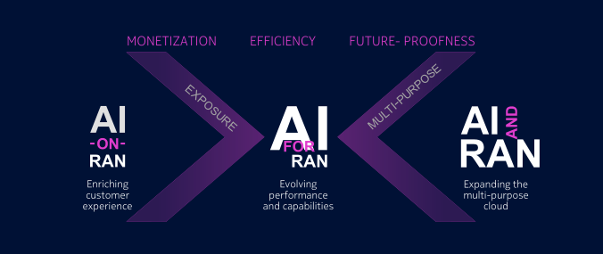

# AI - RAN: The Practical Path to AI - Optimized Networks

## How AI and the mobile network meet in the real world—beyond the “AI takes jobs” headlines.

###### Read Time 3-4 mins 

### Introduction
Recently, I found a very interesting Nokia post that actually articulated the AI-optimization I have been discussing. 

### Why This caught my eye
When most articles are about AI will take jobs, this one demonstrates that it is not only complicated but also crucial to unite AI and the real world, particularly in mobile networks.

### A Personal Lens
I also recall my father who was a former telecom engineer working on CDMA/GSM/2G/3G. At that time, the teams used to visit physically to locate what was down. With the maturation of software they could find faults, remotely, and not have to scale up 100-plus feet to change a small fused bulb. Following that was 2G - 3G - 4G, with ever greater work being done in software than in towers. After reading this white paper by Nokia for service providers, it’s clear how far we’ve come.

### What is AI-RAN
This article explores **AI-RAN** (Artificial Intelligence in Radio Access Network) how AI and the mobile network merge.Thought the initial concept was great: tokens as a new compute currency - very real in the modern AI economy.
It frames three angles:

+ ### AI on RAN: 
    Applications adjust to real-time network traffic. when the network is busy, the apps set the throughput to the necessary size to ensure that calls do not glitch and streams do not stutter.

+ ### AI of RAN: 
    The AI self-tunes the network. the network is self-tuning with AI- it is faster, has fewer delays, and fewer drops.

+ ### AI and RAN: 
    Distributed design of end-to-end performance. apps and the network communicate with one another: apps request what they require (call, video, game), the network requests how busy it is and both of them regulate and keep everything running smoothly.

## We Have all felt the pain
We have all experienced the experience of the network being bad - during a Discord call when playing graphics intensive game (PC or Console not Mobile) Valorant/CS:GO, you experience jitter, packet loss, and poor voice quality (or all three). It is this type of issue that AI-RAN hopes to solve.

### Why Does This Matter

Once these three aspects are combined, we open the door to safer V2X/connected mobility and more dependable real-time services. 

+ Connected mobility / V2X: faster, more reliable messages between cars, roadside units, and edge services.

+ Real-time experiences: live collaboration, cloud gaming, telepresence with fewer stalls and less jitter.

+ Operational wins: lower energy use, fewer truck rolls, and networks that heal and optimize themselves.

## Industry Content(No Hype, Just Trajectory)
This is Industry 4.0 infrastructure—sensors, software, edge/5G, and AI—paving the red carpet for Industry 5.0 (human-centric, sustainable, resilient).
And yes, many sectors are still transitioning from Industry 3.0 to 4.0. AI-RAN is a practical step on that journey, not a leap into sci-fi.

### Key takeaways

+ App bitrate adaptation already exists (e.g., YouTube), but AI-RAN changes who decides, how early, and how fairly—with visibility across the whole cell, not just one device.

+ Edge placement means decisions happen before the stutter, not after.

+ Two-way coordination (apps ↔ network) is the unlock for consistent QoE—especially at peak.

## Bibilography
+ #### Click to read [Nokia AI-RAN](https://nokia.ly/3I1anCK) 